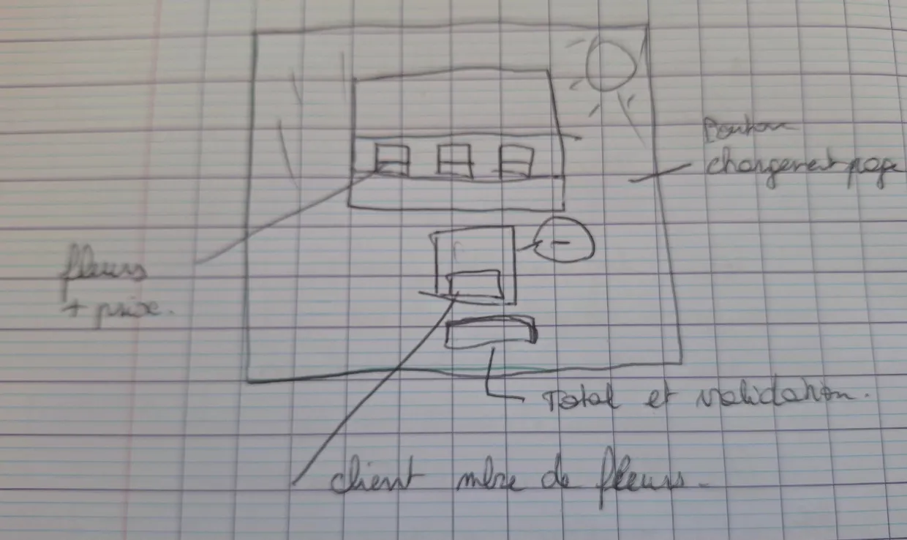
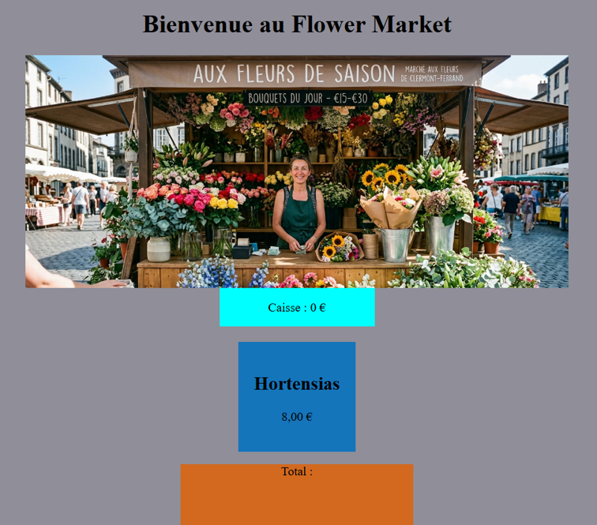
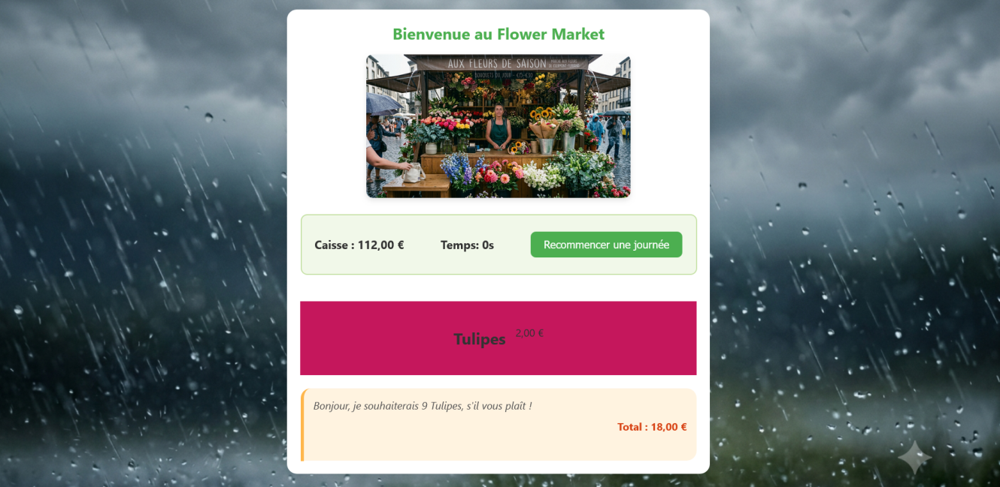

# flower-market
Tenez un mignon petit stand de fleur (un emplacement changeant soumis aux intempéries, aux aléas de vos récoltes et aux envies des clients) et essayez de gagner votre vie grâce à lui!

### Points à aborder:
- calcul
- randomisation
- automatisation

## Phase de réflexion
Pour décider des fonctionnalités principales, nous avons tenu compte des consignes à propos des intempéries, des récoltes et des envies des clients.  
Au départ, les intempéries offraient deux choix: beau temps / mauvais temps, les récoltes comptaient 5 espèces de fleurs: roses / lys / hortensias / pivoines / tulipes, et les envies des clients étaient matérialisées par un nombre aléatoire de fleurs commandées.

Petit schéma de base de l'interface:

## Phase de conception
Nous avons choisi de créer des sections qui correspondent :
- au fond : couleur changeant selon les intempéries (aléatoire)
- au stand : placeholder pour une image future
- à un bac de fleurs : nom de la fleur + son prix et sa couleur (aléatoire)
- au client : placeholder pour le total de la transaction en cours (choix aléatoire et calcul)
- à un bouton "vendre".

## Phase de réalisation
Nous avons pris conscience d'une absence d'automatisation, donc nous avons ajouté une fonction qui génère automatiquement des demandes clients aléatoires avec un timer.   
Nous avons ajouté une section pour afficher l'argent emmagasiné au fur et à mesure des ventes. Celle-ci implique un nouveau calcul: ajout de la transaction en cours au total de la caisse.
Nous avons ajouté des images pour le stand (variables selon les intempéries aléatoires).

Puis, nous avons amélioré le modèle en ajoutant:
- du style sur les boutons
- un compte à rebours pour matérialiser la journée qui passe
- un bouton pour initialiser ou réinitialiser une journée.
- une phrase représentant les envies du client.

## Fonctionnalités à ajouter:
- plusieurs choix de fleurs simultanés
- dépenser l'argent accumulé dans des investissements (approvisionnement de nouvelles espèces de fleurs, améliorations du magasin)
- animations (avatar d'un client)
- images pour les fleurs
- intempéries variables au cours d'une journée
- promotions au cours de la journée
- transformer le timer en horaires "réels"
- faire varier l'afflux de clients en fonction des intempéries.
